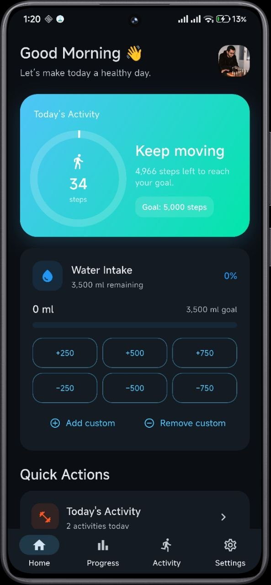
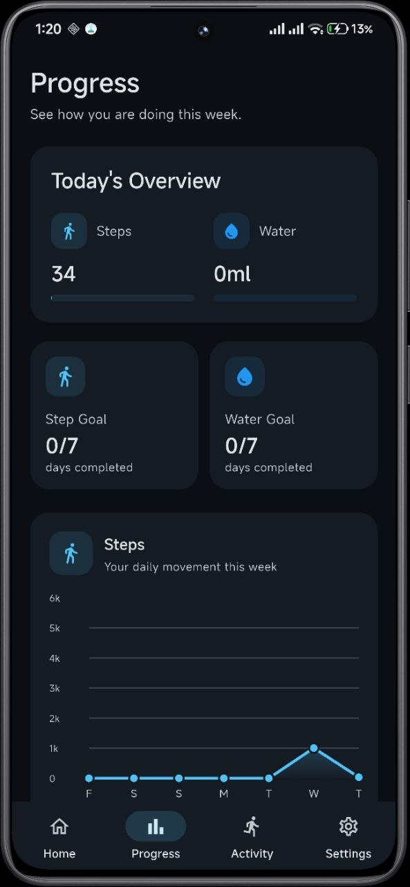
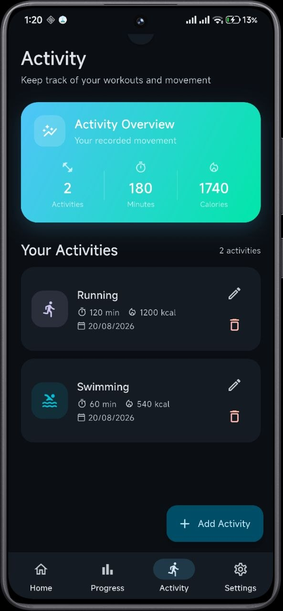
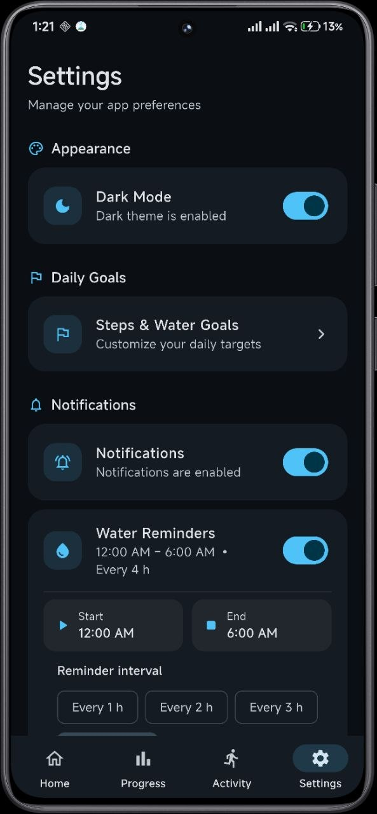

# 🏃 Fitness Tracker

Fitness Tracker is a Flutter mobile application that helps users monitor their daily fitness and health habits in one place.

The app allows users to track daily steps, water intake, physical activities, and personal goals, while providing progress charts and health reminders.

## ✨ Features

- 👟 Track daily steps using Android Health Connect
- 💧 Track and manage daily water intake
- 🏋️ Log physical activities, duration, calories, and notes
- 🔥 View daily activity summaries
- 📊 Track progress using charts and history
- 🎯 Customize daily steps and water goals
- 🔔 Receive water, activity, and goal reminders
- 🌙 Light and Dark themes
- 👤 Manage profile information and profile image
- ⚙️ Health Connect and notification settings

## 🛠️ Built With

- Flutter
- Dart
- Android Health Connect
- SharedPreferences
- Flutter Local Notifications
- fl_chart
- permission_handler
- image_picker
- path_provider

## 📱 Screenshots

<table>
  <tr>
    <td align="center">
      
       
      <b>Home</b>
    </td>
    <td align="center">
      
       
      <b>Progress</b>
    </td>
  </tr>
  <tr>
    <td align="center">
      
       
      <b>Activity</b>
    </td>
    <td align="center">
      
       
      <b>Settings</b>
    </td>
  </tr>
</table>

## 📥 Download

The latest Android release is available here:

[Download Fitness Tracker](https://github.com/Amr-Sadek/fitness_tracker/releases)

## 🚀 Getting Started

### Requirements

- Flutter SDK
- Dart SDK
- Android Studio
- Android device or emulator
- Android Health Connect

### Installation

Clone the repository:

`git clone https://github.com/Amr-Sadek/fitness_tracker.git`

Navigate to the project:

`cd fitness_tracker`

Install dependencies:

`flutter pub get`

Run the application:

`flutter run`

## 👨‍💻 Author

**Amr Sadek**

Flutter Developer
